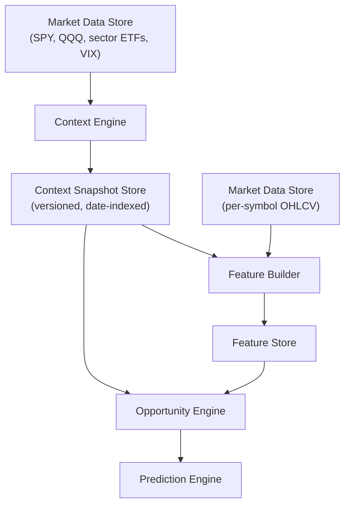

# Context Engine Architecture Proposal v1

**Status:** DRAFT — architecture proposal only, no implementation
**Project:** stock-analyzer
**Scope:** how a Context Engine fits the existing target architecture and the SWING_20
implementation; inputs, outputs, and how an Opportunity Engine would consume them
**Related documents:**

- `docs/00_goal/Research_Strategy_v2.md` (Context Before Signal, Context Engine /
  Opportunity Engine framing — this document is the implementation-level follow-up it calls
  for)
- `docs/01_architecture/High_Level_Architecture.md` (sections 15 and 28, which this proposal
  refines)
- `docs/02_mvp/SWING20_Dataset_Specification_v1.md`,
  `docs/03_research/SWING20_PointInTime_Feature_Specification_v1.md` (section 2,
  market-context features, and section 3, sector-context features — this proposal is the
  architectural backing for those feature candidates, not a replacement for their fail-fast
  evaluation)
- `stock_analyzer/validation/regime.py` (existing, reusable trend+volatility tagging this
  proposal builds on, not replaces)

This is an architecture document. It defines responsibilities, inputs, outputs, and
interfaces. It does not implement a Context Engine module, does not generate a feature
dataset, and does not train a model.

---

## 1. Why a Separate Engine

Per `Research_Strategy_v2.md` section 4 (Context Before Signal), no stock-level signal is
evaluated in isolation — every signal's edge is conditional on the environment it fires in.
Today that conditioning is done ad hoc: `stock_analyzer/validation/regime.py` computes a
trend/volatility tag and callers join it onto observations themselves; there is no single
place that owns "what is today's market environment" as a first-class, versioned output.

The Context Engine formalizes that responsibility as its own component with its own
contract, separate from any stock-level feature computation, so that:

- context can be computed once per date and reused across every opportunity type (SWING_20
  today, others later per `Stock_Analyzer_Goal.md` section 7), instead of being
  recomputed/reimplemented per strategy;
- context's point-in-time correctness can be audited and versioned independently of
  stock-level feature correctness;
- an Opportunity Engine can be swapped, extended, or run per-strategy without touching how
  context is determined.

---

## 2. Relationship to the Target Architecture

This proposal sits between the existing **Market Data Store** and **Feature Builder** in
`High_Level_Architecture.md`'s component diagram (section 3), and refines sections 15
(Opportunity Detection Engine) and 28 (Future Knowledge Graph / Context Engine):



The Context Engine does not consume per-symbol data and does not rank stocks — it consumes
only market/sector-level series (benchmarks, ETFs, VIX) and produces one row per date. The
Opportunity Engine is the first component that combines context with per-symbol data.

---

## 3. Context Engine Responsibilities

For each trading date `t`, determine, using only information available at `t`'s close:

1. **Trend regime** — Bull/Bear, per existing `validation/regime.py` logic (SPY Close vs.
   SPY SMA200). Reusable as-is.
2. **Volatility regime** — Low/Normal/High, per existing `validation/regime.py` 3-tier
   fallback (VIX → SPY realized volatility → SPY ATR% terciles). Reusable as-is.
3. **Secondary market trend** — QQQ relative trend vs. SPY (Feature Specification section
   2.3). New: no existing implementation.
4. **Market breadth** — fraction of the frozen eligible universe above its own 50-day SMA
   (Feature Specification section 2.4). New: no existing implementation; inherits the
   universe's survivorship-bias limitation (`SWING20_Dataset_Specification_v1.md` section
   11) and must carry that caveat forward into every downstream consumer, not just document
   it once.
5. **Sector leadership** — relative trend/momentum ranking across sector ETFs. New: no
   existing implementation. Depends on a sector ETF universe definition (open question, see
   section 8).
6. **Risk-on / risk-off label** — a derived, coarser summary combining (1)-(3), for
   human-readable reporting and coarse filtering; not a new independent computation.

The Context Engine explicitly does **not**:

- rank, score, or filter individual stocks;
- consume per-symbol OHLCV, volume, or fundamentals;
- make a buy/sell/watch decision of any kind.

Its output is descriptive, not prescriptive — matching `Research_Strategy_v2.md` section 5.1
("the Context Engine never recommends stocks").

---

## 4. Inputs

| Input | Source | Point-in-time status |
|---|---|---|
| SPY OHLCV | `get_stock_data("SPY", period)` (existing) | Same-day close only — already the convention in `validation/regime.py` |
| QQQ OHLCV | Same fetch path as SPY, not yet used for this purpose | Same-day close only |
| `^VIX` close | Already fetched in practice, but via a ~15-line `yf.download("^VIX", ...)` block duplicated across at least 15 evaluation scripts (`locked_test.py`, `locked_test_mf1.py`, `locked_test_vc3.py`, `rsi_oversold_test.py`, and others), not the project's shared `get_stock_data` wrapper and its retry/caching logic | Same-day close; correctness is already established (these scripts already pass real VIX into `build_market_regime`) — the gap is duplication, not missing capability |
| Sector ETF OHLCV (e.g. XLK, XLF, XLE, ...) | Not currently fetched | Same-day close only, once added |
| Frozen eligible universe (for breadth) | `stock_analyzer/datasets/swing_20/` frozen `eligibility` artifact | Inherits universe survivorship-bias limitation |

No new raw data source is required — SPY, QQQ, VIX, and sector ETFs are all yfinance
symbols. QQQ and sector ETFs can go through the existing `get_stock_data` path unchanged;
VIX already works today but should be consolidated into a shared function first (section 8,
open question 2) rather than adding a 16th duplicate of the existing fetch block.

---

## 5. Output: Context Snapshot

One row per trading date. Proposed shape (names illustrative, not a frozen schema — that is
implementation work):

```text
date
trend                       # "Bull" | "Bear"
volatility                  # "Low" | "Normal" | "High"
volatility_source           # "vix" | "realized_spy" | "atr_spy"  (existing field, unchanged)
qqq_relative_trend          # float or bucketed
market_breadth              # float in [0, 1]
sector_leadership            # ranked list or per-sector score
risk_label                  # "Risk-On" | "Risk-Off" | "Mixed"
provenance                  # data sources used, fallback tier triggered, generation timestamp
```

This mirrors the existing SWING_20 snapshot discipline
(`SWING20_Dataset_Specification_v1.md`): versioned, reproducible, with explicit provenance —
not a live-computed value re-derived differently by every caller. The Context Snapshot
should be frozen and hash-verifiable the same way `prices`/`labels`/`eligibility` are today,
so that a feature dataset built from it is exactly reproducible.

---

## 6. How the Opportunity Engine Consumes It

The Opportunity Engine joins the Context Snapshot onto per-symbol observations by date, the
same causal-safe pattern `validation/regime.py`'s `tag_observations` already implements
(backward-looking `merge_asof`, so an observation never sees a context value computed after
its own date). This is a **join**, not a merge into a monolithic feature table computed by
one function — Context Engine output and stock-level features remain independently
versioned and independently testable, per `Research_Strategy_v2.md` Principle 5 ("context is
tested before complexity").

Concretely, for SWING_20:

- `spy_trend`, `spy_volatility_bucket` (Feature Specification 2.1, 2.2) come directly from
  the Context Snapshot's `trend`/`volatility` fields.
- `qqq_relative_trend`, `market_breadth` (Feature Specification 2.3, 2.4) come from the new
  Context Snapshot fields once implemented.
- Sector-context features (Feature Specification section 3) require `sector_identity` to map
  a stock to a sector before the Context Snapshot's `sector_leadership` becomes usable per
  stock — this dependency is exactly why Feature Specification 3.1 gates the rest of section
  3 behind it.

The Opportunity Engine's own job — per `Research_Strategy_v2.md` section 5.2 — is then to
evaluate stock-level signals **conditioned on** these joined context fields (e.g., "does VC3
compression predict a hit only in `Bull + Low volatility + sector leading`"), which is
exactly the interaction-term evaluation already specified per-feature in the Feature
Specification's "expected interaction with market or sector context" column.

---

## 7. Point-in-Time and Reproducibility Requirements

Carried over from the existing, already-audited SWING_20 pipeline, not new:

- same-day-close causality convention, matching `validation/regime.py`'s documented
  rationale;
- versioned, hash-verifiable output artifact, matching
  `SWING20_Dataset_Specification_v1.md`'s snapshot discipline;
- explicit provenance (data source, fallback tier, generation timestamp) recorded per
  snapshot, matching the existing manifest pattern in
  `stock_analyzer/datasets/swing_20/prepare.py`;
- known limitations (universe survivorship bias for breadth; sector identity not
  point-in-time) must be carried forward into every consumer's documentation, not stated once
  and forgotten — this is the same discipline `SWING20_Dataset_Specification_v1.md` section
  11 already applies.

---

## 8. Open Design Questions (prerequisites, not yet decided)

1. **Sector ETF universe.** Which ETFs represent "sectors" (GICS 11-sector SPDR set, a
   narrower set, or something else)? Not decided here — this is a research decision, not an
   architecture one, and should be made when sector-context features are actually
   implemented (gated behind Feature Specification 3.3's fail-fast result, per that
   document).
2. **VIX fetch consolidation.** `validation/regime.py`'s `vix_close` parameter is already fed
   real `^VIX` data — correctly — but by a ~15-line fetch block copy-pasted across at least
   15 evaluation scripts, using a raw `yf.download` call rather than the project's shared
   `get_stock_data` fetch/retry/cache path. Before the Context Engine is implemented, this
   should become one reusable function (e.g. alongside `get_stock_data` or as a thin
   VIX-specific wrapper around it) rather than a 16th copy of the same block. This is a small
   refactor, not a new capability — VIX already works.
3. **Context Snapshot update cadence.** Computed once per trading day (end-of-day), matching
   how the rest of the SWING_20 pipeline already operates — no intraday context updates are
   proposed here.
4. **Where the Context Snapshot lives.** Proposed to follow the existing
   `artifacts/<name>/snapshots/<version>/` pattern already used for SWING_20, for consistency
   and reuse of the existing hash-verification tooling — not a new storage paradigm.

---

## 9. Explicit Non-Goals for v1

- No LLM-based context interpretation or narrative generation (that is the future Knowledge
  Graph / LLM context layer noted in `High_Level_Architecture.md` section 28, explicitly out
  of scope here).
- No predictive regime modeling (e.g. forecasting tomorrow's regime) — the Context Engine
  tags the *current*, already-knowable-at-close regime, nothing more.
- No automatic sector or ETF universe discovery — the sector ETF set (open question 1 above)
  is a manually curated decision, not a learned one, at least in v1.
- No implementation. This document does not produce `context_engine.py`, a schema migration,
  or a fetch script. The next step, if this proposal is accepted, is a scoped implementation
  task starting with the already-existing `validation/regime.py` extension (trend +
  volatility are already done; QQQ relative trend and market breadth are the smallest
  incremental additions) rather than sector leadership, which depends on the still-open
  sector ETF question.
