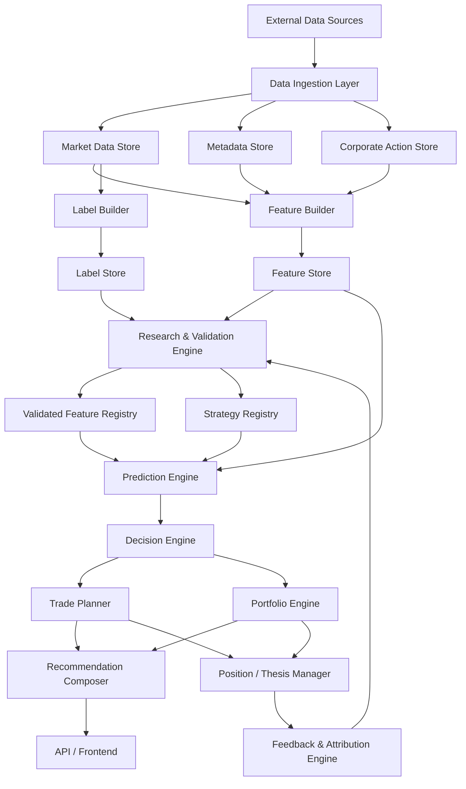
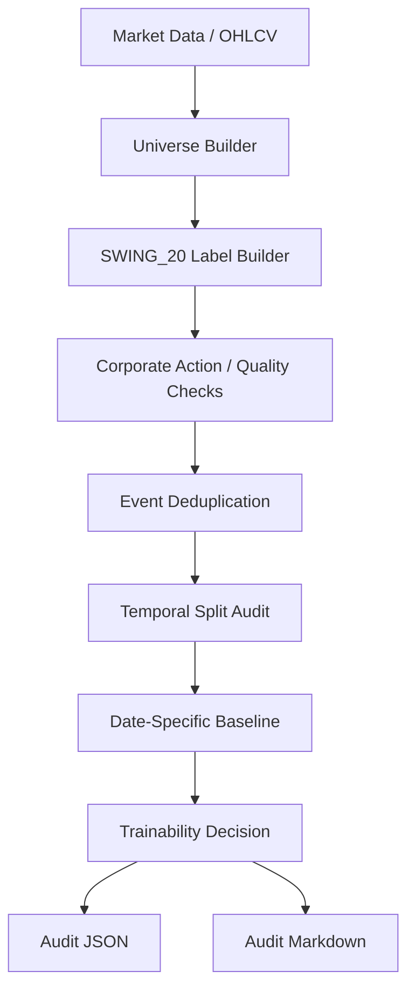

# Stock Analyzer High-Level Architecture v1.0

**Status:** Target architecture baseline  
**Project:** stock-analyzer  
**Scope:** long-term high-level architecture and MVP alignment  
**Related documents:** `docs/00_goal/Research_Strategy_v2.md` (governing research
philosophy — Context Before Signal, Context Engine / Opportunity Engine framing that refines
sections 15 and 28 below; see the forthcoming `Context Engine Architecture Proposal v1` for
the implementation-level detail this document does not yet contain)

This document defines the high-level target architecture of Stock Analyzer. It describes
the intended system shape, major components, and data flow. It is not a detailed
implementation plan for every component. MVP 1 implements only the SWING_20 Dataset Audit
slice of this architecture.

---

## 1. Architectural Goal

Stock Analyzer should become an investment decision support platform built around:

```text
Data → Features → Labels → Research → Prediction → Decision → Trade Plan → Monitoring → Learning
```

The architecture must support:

- strict point-in-time data handling;
- validated feature research;
- machine-learning prediction;
- decision logic separated from prediction;
- portfolio-aware recommendations;
- transparent explanations;
- feedback and model governance.

---

## 2. Core Architectural Principle

The system should not be centered around a Recommendation Engine alone.

The core sequence is:

```text
Prediction Engine
    ↓
Decision Engine
    ↓
Recommendation Composer
```

These responsibilities must remain separate.

Prediction answers:

```text
What is likely to happen?
```

Decision answers:

```text
What should be done?
```

Recommendation Composer answers:

```text
How should the decision be presented to the user?
```

---

## 3. High-Level Component Diagram



---

## 4. Data Ingestion Layer

Purpose:

- collect raw market data;
- collect metadata;
- collect corporate action information;
- normalize external data into internal formats;
- preserve raw source traceability.

Inputs may include:

- OHLCV prices;
- ticker lists;
- exchange metadata;
- instrument type;
- sector and industry;
- market-cap data;
- corporate actions;
- benchmark data such as SPY;
- volatility data such as VIX, if available.

The ingestion layer must preserve enough metadata to support point-in-time analysis and
auditability.

---

## 5. Market Data Store

The Market Data Store contains historical price and volume data.

Required properties:

- adjusted and raw price handling must be explicit;
- OHLCV data must be consistent;
- missing bars must be detectable;
- stale prices must be detectable;
- duplicate bars must be detectable;
- data source and retrieval timestamp should be available where possible.

This store feeds both research and production-style analysis.

---

## 6. Metadata Store

The Metadata Store contains information about instruments.

Examples:

- ticker;
- company name;
- exchange;
- instrument type;
- sector;
- industry;
- country;
- market cap;
- active/inactive status.

Point-in-time correctness varies by metadata field. The system must mark fields that are
not point-in-time safe.

---

## 7. Corporate Action Store

The Corporate Action Store tracks:

- splits;
- reverse splits;
- dividends, if relevant;
- symbol changes;
- mergers;
- delistings, if available.

The purpose is to prevent artificial labels and false historical returns caused by bad
price adjustment handling.

---

## 8. Feature Builder

The Feature Builder converts point-in-time data into model-ready features.

Feature families:

- price return features;
- trend features;
- momentum features;
- volume features;
- volatility features;
- market context features;
- validated signal features;
- future fundamental features, only when point-in-time safe.

Feature computation must be causal:

```text
Feature at date t may use information available at or before t.
Feature at date t may not use information after t.
```

---

## 9. Feature Store

The Feature Store stores computed features by:

- date;
- ticker;
- feature name;
- feature version;
- computation version;
- point-in-time assumptions.

Its purpose is to make research and prediction reproducible.

---

## 10. Label Builder

The Label Builder creates future outcome labels used for research and model training.

Examples:

- triple-barrier outcomes;
- MFE;
- MAE;
- R-multiple;
- SWING_20 target hit;
- days-to-target;
- target-before-stop;
- close return over horizon.

Labels may use future data because they describe outcomes. Labels must never leak into
features.

---

## 11. Label Store

The Label Store is the counterpart to the Feature Store.

It stores:

- label name;
- label version;
- target definition;
- entry assumption;
- horizon;
- stop assumptions, if any;
- date;
- ticker;
- outcome values.

The Label Store is essential for machine-learning reproducibility.

---

## 12. Research & Validation Engine

The Research & Validation Engine is the quality gate of the system.

Responsibilities:

- hypothesis registration;
- discovery research;
- signal lab testing;
- train / validation / locked-test separation;
- event deduplication;
- bootstrap or block-bootstrap uncertainty;
- negative-result documentation;
- signal lifecycle management.

Signal lifecycle:

```text
Candidate
    ↓
Promising
    ↓
Conditional
    ↓
Validated
    ↓
Core / Archived
```

Rejected signals should be archived, not silently forgotten.

### 12.1 Research Registry

The system should maintain a Research Registry separate from the Validated Feature
Registry.

The Research Registry records the history of research work, not only the final features
that survived validation.

For each research item, it should track:

- research question;
- hypothesis;
- opportunity type;
- dataset version;
- label version;
- feature set;
- validation method;
- result;
- status;
- rejection or validation reason;
- date;
- links to reports, artifacts, and code.

Possible statuses:

```text
Draft
Registered
Exploratory
In Validation
Validated
Rejected
Archived
Deferred
```

The purpose is to make future decisions auditable. Six months later, the project should
still be able to answer:

```text
Why did we reject RSI < 30?
Why did C1 become a validated candidate?
Why did we move from signal rules to SWING_20 dataset modeling?
```

---

## 13. Validated Feature Registry

The Validated Feature Registry stores features and signals that have passed research
criteria.

For each feature, it should track:

- name;
- version;
- phenomenon represented;
- required inputs;
- validation status;
- regimes where useful;
- limitations;
- source experiment;
- last validation date.

The registry prevents unvalidated ideas from entering production decision logic.

---

## 14. Strategy Registry

The Strategy Registry defines opportunity types.

Each strategy may define:

- target;
- horizon;
- label;
- feature families;
- model;
- entry assumptions;
- exit assumptions;
- risk model;
- sizing model;
- evaluation metrics.

Initial strategy:

```text
SWING_20
```

Future strategies may include:

- reversal;
- breakout;
- catalyst;
- volatility expansion;
- longer-term momentum;
- defensive rotation;
- thematic setups.

---

## 15. Opportunity Detection Engine

> **Note:** `docs/00_goal/Research_Strategy_v2.md` reframes this engine's relationship to
> context: rather than Context being one input alongside Pattern and Event, the strategy
> treats context (market regime, volatility regime, sector behavior) as an explicit,
> first-class upstream stage — a "Context Engine" — that this Opportunity Detection Engine
> then evaluates stocks within. See the forthcoming `Context Engine Architecture Proposal v1`
> for how this splits into concrete components.

The Opportunity Detection Engine identifies candidate situations.

It generalizes the earlier idea of Pattern Detection:

```text
Pattern + Event + Context = Opportunity
```

Examples:

- volatility compression plus activation;
- support context plus Bear-regime momentum;
- unusual volume after quiet period;
- sector rotation plus stock-level strength;
- post-earnings continuation.

The engine may feed candidates into Prediction Engine, but it should not itself be the
final decision layer.

---

## 16. Candidate Generation

Candidate generation should be two-stage.

```text
Full Universe
    ↓
Fast Screening
    ↓
Candidate Pool
    ↓
Deep Analysis
    ↓
Prediction
    ↓
Decision
```

Fast screening reduces computational load. Deep analysis applies richer features,
strategy-specific logic, and prediction models.

---

## 17. Prediction Engine

The Prediction Engine is the analytical core.

It estimates future outcome distributions, such as:

- probability of hitting target;
- probability of stop before target;
- expected return;
- expected downside;
- expected MFE;
- expected MAE;
- expected holding time;
- uncertainty and confidence intervals.

The Prediction Engine does not decide whether to buy. It produces calibrated forecasts
for the Decision Engine.

---

## 18. Decision Engine

The Decision Engine converts predictions into actions.

It should consider:

- expected net value;
- confidence;
- downside risk;
- opportunity cost;
- transaction costs;
- slippage;
- portfolio exposure;
- regime;
- strategy rules;
- available capital.

Possible decisions:

- buy;
- wait;
- avoid;
- watchlist;
- add;
- reduce;
- sell;
- no action.

---

## 19. Recommendation Composer

The Recommendation Composer turns decisions into user-facing outputs.

A recommendation should include:

- action;
- ticker;
- opportunity type;
- prediction summary;
- expected value;
- confidence;
- target;
- stop;
- maximum acceptable entry price;
- position size suggestion;
- explanation;
- key risks;
- alternatives considered.

The composer should not invent reasoning. It should summarize model outputs, decision
rules, and available evidence.

---

## 20. Trade Planner

The Trade Planner creates practical trade instructions.

It may define:

- entry zone;
- maximum buy price;
- initial stop;
- target;
- partial exit plan;
- invalidation rules;
- expected holding period;
- order type guidance, if later required.

MVP 1 does not implement Trade Planner.

---

## 21. Portfolio Engine

The Portfolio Engine manages capital allocation and risk.

Responsibilities:

- available capital;
- position sizing;
- sector exposure;
- theme exposure;
- correlation risk;
- drawdown risk;
- simultaneous-signal clustering;
- turnover control;
- transaction cost awareness.

The portfolio layer should optimize capital allocation, not merely check risk after the
fact.

---

## 22. Position / Thesis Manager

Positions should be tied to investment theses.

For each position, track:

- original thesis;
- opportunity type;
- entry rationale;
- target;
- stop;
- invalidation conditions;
- current thesis status;
- whether the thesis is improving or weakening;
- whether a better opportunity exists.

The long-term system should monitor the thesis, not just price movement.

---

## 23. Feedback & Attribution Engine

The Feedback Engine closes the loop.

It tracks:

- realized outcomes vs predictions;
- model calibration;
- strategy-level performance;
- feature drift;
- regime-specific performance;
- attribution by component;
- false positives;
- missed opportunities.

Feedback can generate new research hypotheses, but model changes must pass validation
before deployment.

---

## 24. Model Governance

Each model should have:

- model version;
- training dataset version;
- feature set version;
- label version;
- validation report;
- calibration report;
- deployment status;
- performance monitoring;
- retirement criteria.

Possible statuses:

```text
Research
Validated
Paper Trading
Production Candidate
Production
Degraded
Retired
```

Automatic retraining without validation is out of scope.

---

## 25. Architecture Decision Records

The project should maintain Architecture Decision Records (ADRs) for major methodological
and architectural choices.

ADR examples:

- why SWING_20 was selected as MVP 1;
- why the first target is +20% within 20 trading days;
- why entry uses next-day Open instead of signal-day Close;
- why the locked test cannot be used for feature selection;
- why Gradient Boosting is considered only after Logistic Regression;
- why calendar-time block bootstrap is preferred for dependent observations.

Each ADR should include:

- decision;
- context;
- options considered;
- chosen option;
- consequences;
- status;
- date.

ADRs prevent important rationale from being buried in chat history or Git diffs.

---

## 26. MVP 1 Architecture Slice

MVP 1 implements only the dataset-audit slice:



MVP 1 does not implement Prediction Engine, Decision Engine, Recommendation Composer,
Portfolio Engine, or Position Manager.

---

## 27. Data Flow After MVP 1

If the SWING_20 audit returns `TRAINABLE` or `CONDITIONALLY_TRAINABLE`, the next sequence
is:

```text
Audit Accepted
    ↓
Frozen Baselines
    ↓
Logistic Regression
    ↓
Gradient Boosting
    ↓
Validation Ablation
    ↓
Calibration
    ↓
One Locked Temporal Test
    ↓
GO / CONDITIONAL GO / STOP
```

Only after this should the system move toward recommendation outputs.

---

## 28. Future Knowledge Graph / Context Engine

> **Note:** the "Context Engine" named here is the same concept `Research_Strategy_v2.md`
> elevates to a governing architectural principle (Context Before Signal), not only a future
> nice-to-have. The Knowledge Graph remains a later addition; the Context Engine's core
> responsibility (market regime, volatility regime, sector leadership, breadth) does not
> depend on the Knowledge Graph existing first.

A Knowledge Graph may be useful later for representing relationships such as:

- companies;
- sectors;
- industries;
- themes;
- suppliers;
- customers;
- commodities;
- macro drivers;
- AI/datacenter/power/nuclear themes;
- related tickers.

This is not part of MVP 1.

The Knowledge Graph becomes valuable when the project adds LLM-supported context,
thematic reasoning, and thesis management.

---

## 29. Architecture Non-Goals

The high-level architecture does not imply that all components must be built now.

Do not implement before MVP evidence justifies it:

- full frontend;
- production API;
- automatic trading;
- knowledge graph;
- thesis manager;
- automated retraining;
- LLM-based analysis;
- portfolio optimizer;
- complex order management.

The architecture is a map, not a sprint plan.

---

## 30. Guiding Architecture Principle

The system should preserve a clean separation:

```text
Research validates what may be useful.
Prediction estimates what may happen.
Decision decides what to do.
Recommendation explains the decision.
Portfolio controls capital and risk.
Feedback improves the next research cycle.
```

This separation is the main defense against turning the project into an opaque,
overfitted score generator.
