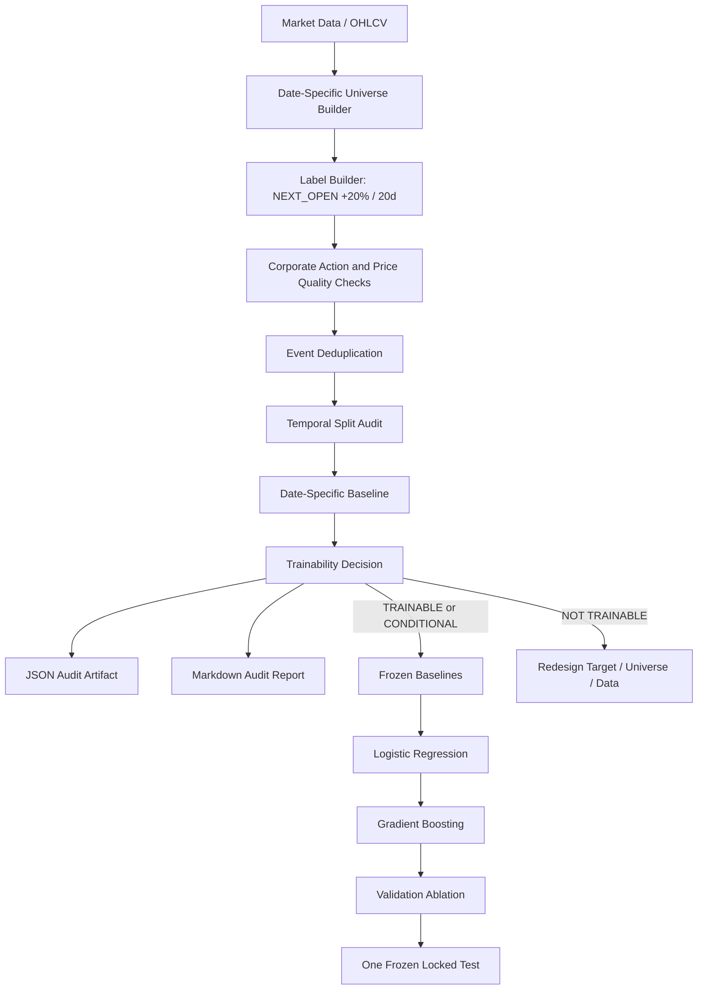

# MVP 1 Specification v1.0 — SWING_20 Dataset Audit

**Status:** FROZEN  
**Project:** stock-analyzer  
**Document owner:** project research process  
**Primary next deliverable:** SWING_20 Dataset Audit generator and report

This document defines the first MVP of the stock-analyzer project. It is the
implementation specification for deciding whether the SWING_20 prediction problem is
trainable with the current data and methodology.

MVP 1 does not start with LightGBM, an API, a frontend, a trade planner, or a portfolio
manager. It starts with a dataset audit. The goal is to prove that the target, universe,
labels, historical data, and evaluation setup are valid enough to justify model training.

---

## 1. Executive Summary

The project goal is to build an investment decision support system that can identify
stocks with attractive short-term upside potential. Earlier research established a strict
validation framework and found several small but real signals. The next phase moves from
signal research toward prediction modeling, but only after verifying that the target
dataset is valid.

MVP 1 focuses on one opportunity type:

> **SWING_20:** liquid US stocks that can rise at least 20% within the next 20 trading days.

The MVP hypothesis is:

> Can a model built from point-in-time price, volume, volatility, market context, and
> validated signal features rank liquid US stocks so that its highest-scored candidates
> reach at least +20% within the next 20 trading days materially more often than suitable
> baselines?

Before training any model, the project must produce a formal SWING_20 Dataset Audit.
The audit must decide one of:

- `TRAINABLE`
- `CONDITIONALLY_TRAINABLE`
- `NOT_TRAINABLE_AS_DEFINED`

Only after the audit is reviewed and accepted may the project continue to baseline models,
logistic regression, gradient boosting, calibration, and locked temporal testing.

---

## 2. MVP Scope

### 2.1 In Scope

MVP 1 includes:

- SWING_20 target definition.
- Date-by-date eligible universe construction.
- Next-day Open based label generation.
- Corporate action and price-adjustment validation.
- Raw positive observations vs deduplicated positive events.
- Calendar-time and ticker-level dependence diagnostics.
- Train / validation / locked-test temporal split audit.
- Date-specific eligible-universe baseline.
- Data quality, leakage, and point-in-time risk reporting.
- Machine-readable audit JSON.
- Human-readable audit Markdown report.
- Deterministic trainability decision.

### 2.2 Out of Scope

MVP 1 does not include:

- Logistic Regression.
- LightGBM, XGBoost, CatBoost, or other predictive models.
- Feature selection.
- Probability calibration.
- Recommendation API.
- Frontend.
- Trade Planner.
- Position Manager.
- Portfolio Engine.
- Thesis Management.
- Knowledge Graph.
- LLM-based context analysis.
- Automatic retraining or deployment.

These components belong to later phases and must not be started before the dataset audit
is accepted.

---

## 3. Design Principles

### 3.1 Audit Before Modeling

No predictive model is trained until the audit confirms that the target is trainable or
conditionally trainable.

### 3.2 Point-in-Time Discipline

Every feature, universe membership decision, and label input must respect information
availability at the signal date. Future data may be used only for label generation.

### 3.3 Realistic Entry

The entry price is the next trading day's Open, not the signal day's Close. This prevents
unrealistic execution assumptions.

### 3.4 Same Data Basis

Entry Open, future High, future Low, future Close, split adjustments, and volume data must
be internally consistent. Mixed raw and adjusted prices are a hard blocker.

### 3.5 Date-Specific Baselines

Baseline hit rates must be computed using the eligible universe available on each date.
A single global positive rate is not sufficient.

### 3.6 Events Are Not Independent Just Because Observations Are Daily

A single 20% price move can create many consecutive positive labels for the same ticker.
The audit must distinguish raw daily observations from deduplicated economic events.

### 3.7 No Silent Optimization

The audit may conclude that the target is not trainable as defined. It must not silently
change the target, filters, split rules, deduplication logic, or baseline definition.

---

## 4. SWING_20 Definition

### 4.1 Opportunity Type

`SWING_20` is a short-term upside opportunity:

- Universe: liquid US stocks.
- Signal date: date `t`.
- Entry: next trading day Open.
- Target: entry price multiplied by `1.20`.
- Horizon: next 20 trading days after entry.
- Positive label: target is reached by future High within the horizon.

### 4.2 Label Definition

For ticker `s` and signal date `t`:

```text
entry_date = next trading day after t
entry_price = Open[s, entry_date]
target_price = entry_price * 1.20
horizon = 20 trading days after entry_date
positive = any(High[s, d] >= target_price for d in horizon)
```

Additional outcome metrics:

```text
days_to_target
mfe_20d
mae_20d
close_return_20d
target_before_stop
target_before_fixed_stop
target_before_atr_stop
large_gap_at_entry
target_already_reached_relative_to_signal_close
```

### 4.3 Entry Gap Diagnostics

Because entry is next-day Open, the audit must report cases where a large move occurs
between signal Close and entry Open.

The metric:

```text
target_already_reached_at_entry_count =
    count(next_open >= signal_close * 1.20)
```

This does not mean the entry-based target is already reached. It means the price already
moved at least 20% from signal Close before realistic entry. These cases may be difficult
to trade and must be visible in the audit.

### 4.4 Stop Diagnostics

The MVP target is +20% within 20 trading days. The audit should still compute stop-related
diagnostics because future modeling and practical strategy design need downside context:

- fixed stop, if configured;
- ATR-based stop, if ATR data is available;
- target-before-stop rate.

Stop diagnostics do not change the primary positive label in MVP 1.

---

## 5. Dataset Audit Deliverables

### 5.1 Audit Inputs

The SWING_20 Dataset Audit should use existing project data and computations where
available. Expected inputs:

- stock universe and instrument metadata;
- historical OHLCV data;
- market-regime data;
- exchange and instrument-type metadata;
- corporate action / adjustment information, if available;
- existing feature calculations;
- validated signal outputs, if available.

If an expected input is missing, unreliable, or not point-in-time safe, the audit must
report that limitation explicitly rather than silently substituting a weaker source.

The audit must produce two artifacts:

```text
artifacts/swing_20_dataset_audit.json
artifacts/swing_20_dataset_audit.md
```

The JSON output is for pipelines and automated checks. The Markdown output is for human
review and sign-off.

---

## 6. Audit Report Required Sections

The Markdown audit report must contain at least:

1. Executive Summary
2. Universe Audit
3. Label Distribution
4. Temporal Stability
5. Regime and Segment Distribution
6. Event Deduplication
7. Outcome Profile
8. Data Quality
9. Leakage and Point-in-Time Risks
10. Trainability Decision
11. Recommended Next Step

---

## 7. Universe Audit

The universe audit must be computed date by date.

Required fields:

- date range;
- ticker count by date;
- eligible ticker count by date;
- included tickers;
- excluded tickers;
- exclusion reasons;
- history length per ticker/date;
- price at eligibility date;
- ADV20 at eligibility date;
- instrument type;
- exchange;
- exchange distribution;
- instrument type distribution;
- minimum price filter result;
- liquidity filter result;
- minimum history filter result;
- survivorship bias limitations.

Recommended default eligibility filters:

```yaml
universe:
  market: US
  include_exchanges:
    - NASDAQ
    - NYSE
    - NYSE_AMERICAN
  include_instrument_types:
    - COMMON_STOCK
  minimum_price: 5.0
  minimum_adv20: 5000000
  minimum_history_days: 250
```

These defaults are configuration, not hidden constants.

### 7.1 Exclusion Reasons

Exclusion reasons should be explicit and countable:

```text
NOT_COMMON_STOCK
ETF_OR_FUND
WARRANT_OR_RIGHT
PREFERRED_STOCK
INSUFFICIENT_HISTORY
LOW_PRICE
LOW_ADV20
MISSING_OHLCV
MISSING_ENTRY_OPEN
SUSPICIOUS_PRICE_SERIES
UNSUPPORTED_EXCHANGE
```

---

## 8. Label Distribution Audit

The audit must report:

- total observations;
- raw positive observations;
- raw positive rate;
- deduplicated positive events;
- deduplicated event rate;
- positive counts and rates by year;
- positive counts and rates by quarter;
- positive counts and rates by Bull/Bear regime;
- positive counts and rates by sector, if sector data is reliable;
- positive counts and rates by market-cap bucket, if market-cap data is reliable;
- ticker concentration;
- calendar-time clustering.

### 8.1 Required Split-Level Counts

Report all counts separately for:

- train period;
- validation period;
- locked-test period.

The audit must not rely only on overall positive rate. A target may look trainable overall
but fail because validation or locked test contains too few positive events.

---

## 9. Raw Observations vs Deduplicated Events

Daily labels are valid point-in-time observations, but they are not always independent
economic opportunities.

Example:

```text
Ticker ABC rises 30% over the next 20 trading days.
Ten consecutive signal dates may all receive positive labels.
Economically, this may describe one major move, not ten independent opportunities.
```

The audit must report:

```text
raw_positive_observations
deduplicated_positive_events
raw_to_event_inflation_factor
median_positive_run_length
p90_positive_run_length
max_positive_run_length
events_per_ticker
top_10_ticker_event_share
```

### 9.1 Deduplication Rule

The deduplication rule must be frozen before modeling. The recommended default:

> For the same ticker, positive observations whose 20-day outcome windows overlap are
> grouped into one deduplicated economic event.

The audit may report alternative descriptive diagnostics, but the primary deduplicated
event count must use the frozen rule.

---

## 10. Outcome Profile

The audit must describe the distribution of future outcomes, not just target-hit labels.

Required:

- MFE distribution;
- MAE distribution;
- close-to-close 20-day return distribution;
- days-to-target distribution;
- target-before-stop rate;
- target-before-ATR-stop rate, if ATR is available;
- target hits by ticker;
- target hits by calendar period;
- target hits by regime.

Recommended robust statistics:

- mean;
- median;
- p10;
- p25;
- p75;
- p90;
- p95;
- trimmed mean;
- winsorized mean, if useful.

---

## 11. Corporate Action and Price Quality Audit

Corporate action validation is a hard requirement. Bad split handling can invalidate the
entire label.

The audit must confirm:

- entry Open and future High use the same adjustment basis;
- entry Open and future Low use the same adjustment basis;
- entry and all future OHLC prices used by the label use the same adjustment basis;
- split and reverse split events do not create artificial 20% target hits;
- missing next-day Open is not silently replaced with Close;
- OHLC values are internally consistent;
- stale prices are detected;
- duplicate bars are detected;
- extreme suspicious jumps are reported;
- target is not checked before entry.

### 11.1 Required Price Quality Counts

```text
missing_entry_open_count
missing_future_high_count
missing_future_low_count
adjustment_basis_conflict_count
corporate_action_conflict_count
split_artifact_count
reverse_split_artifact_count
ohlc_inconsistency_count
stale_price_count
duplicate_bar_count
extreme_gap_count
target_already_reached_at_entry_count
```

Any unresolved adjustment-basis conflict is a hard blocker.

---

## 12. Date-Specific Baseline

The eligible-universe baseline must be computed per date:

```text
daily_baseline_rate[t] =
    positive_labels[t] / eligible_universe_size[t]
```

Then aggregate by:

- month;
- quarter;
- year;
- Bull/Bear regime;
- validation split;
- locked-test split.

This prevents a model from appearing strong simply because it selected candidates during
favorable market periods.

Later model evaluation must compare top-ranked candidates against the same-date eligible
universe, not just against one global historical average.

---

## 13. Temporal Splits

MVP 1 uses temporal splits. Exact dates must be determined from available history and
frozen in configuration.

Recommended default:

```yaml
splits:
  method: temporal
  train_fraction: 0.60
  validation_fraction: 0.20
  locked_test_fraction: 0.20
```

The audit must report:

- split start and end dates;
- observations per split;
- raw positive observations per split;
- deduplicated positive events per split;
- positive rate per split;
- Bull/Bear composition per split;
- calendar-time clustering per split.

The split audit must also confirm:

- no future information affects the train period;
- no scaler, imputer, encoder, calibration model, or other fit-able transform is fit
  during the dataset-audit phase;
- every split contains both raw and deduplicated positive counts;
- the locked-test period is not inspected for model selection.

The locked test must remain untouched until one final model configuration is selected.

---

## 14. Regime and Segment Distribution

At minimum, the audit must include Bull/Bear regime split. The recommended definition:

```text
Bull = SPY Close >= SPY SMA200
Bear = SPY Close < SPY SMA200
```

The audit may include volatility regime if available, but volatility regime is not required
for MVP 1 trainability.

Segment diagnostics may include:

- sector;
- market-cap bucket;
- ADV20 bucket;
- ATR% bucket;
- price bucket.

If sector or market-cap data is not point-in-time reliable, it must be marked as a
limitation and not used as a hard trainability criterion.

---

## 15. Data Quality and Point-in-Time Risks

The audit must explicitly report point-in-time limitations.

Examples:

```text
SURVIVORSHIP_BIAS_PRESENT
SECTOR_NOT_POINT_IN_TIME
MARKET_CAP_NOT_POINT_IN_TIME
FUNDAMENTALS_NOT_POINT_IN_TIME
UNIVERSE_MEMBERSHIP_NOT_POINT_IN_TIME
```

MVP 1 does not use non-point-in-time fundamentals in the first model. If fundamentals are
not available with publication dates and availability timestamps, they must be excluded
from the initial modeling phase.

---

## 16. Trainability Decision Framework

The audit decision must be deterministic enough to be reproducible, but not reduced to one
arbitrary number. It has three layers:

1. Hard blockers
2. Warnings
3. Descriptive diagnostics

### 16.1 Hard Blockers

If any hard blocker is present, the audit cannot return `TRAINABLE`.

Hard blockers include:

```text
ADJUSTMENT_BASIS_INCONSISTENT
LABEL_LOOKAHEAD_DETECTED
TEMPORAL_LOCKED_TEST_NOT_POSSIBLE
INSUFFICIENT_TEST_POSITIVES
UNRESOLVED_SPLIT_ARTIFACTS
MISSING_ENTRY_PRICE_UNHANDLED
TARGET_TOO_RARE_TO_EVALUATE
NO_CREDIBLE_ELIGIBLE_UNIVERSE
```

### 16.2 Warnings

Warnings may lead to `CONDITIONALLY_TRAINABLE`.

Warnings include:

```text
SURVIVORSHIP_BIAS_PRESENT
SECTOR_NOT_POINT_IN_TIME
MARKET_CAP_NOT_POINT_IN_TIME
SHORT_HISTORY
LOW_BEAR_SAMPLE
INSUFFICIENT_BEAR_TEST_EVENTS
LOW_VALIDATION_POSITIVES
HIGH_FEATURE_MISSINGNESS
HIGH_EVENT_DUPLICATION
HIGH_CALENDAR_CLUSTERING
UNIVERSE_MEMBERSHIP_INCOMPLETE
```

### 16.3 Descriptive Diagnostics

These do not automatically determine the decision, but they guide later modeling:

- sector distribution;
- market-cap distribution;
- Bull/Bear differences;
- days-to-target;
- MFE/MAE;
- event clustering;
- ticker concentration;
- ADV20 distribution;
- price distribution.

### 16.4 Decision Definitions

#### TRAINABLE

All of the following must be true:

- no hard blockers;
- sufficient raw and deduplicated positives across train, validation, and locked test;
- positive labels are not concentrated only in one short period;
- entry and target prices are adjustment-consistent;
- missingness is manageable;
- event duplication is measured and controllable;
- locked temporal test period is viable.

#### CONDITIONALLY_TRAINABLE

The target appears learnable, but at least one important limitation exists:

- more history may be needed;
- universe may need expansion;
- some feature families may need removal;
- point-in-time limitations exist but are documented;
- some regimes or segments have low statistical power;
- calibration may be unreliable due to rare positives.

#### NOT_TRAINABLE_AS_DEFINED

The current definition should not proceed to modeling:

- target is too rare;
- positive events are dominated by duplicated observations;
- price adjustments invalidate labels;
- leakage cannot be removed;
- no credible temporal test can be formed;
- survivorship bias is too severe to interpret results;
- locked-test period has too few positives for meaningful evaluation.

---

## 17. Recommended Technical Structure

Recommended implementation structure:

```text
stock_analyzer/
  datasets/
    swing_20/
      __init__.py
      config.py
      universe.py
      labels.py
      events.py
      splits.py
      quality.py
      baseline.py
      audit.py
      schema.py
      models.py

  evaluation/
    swing_20_dataset_audit_report.py

scripts/
  run_swing_20_dataset_audit.py
```

### 17.1 Module Responsibilities

#### `config.py`

Frozen SWING_20 audit configuration.

#### `universe.py`

Builds date-specific eligible universe and exclusion reason counts. It must store enough
detail to explain every inclusion and exclusion decision:

- included tickers;
- excluded tickers;
- exclusion reason;
- available price-history length;
- eligibility-date price;
- ADV20;
- instrument type;
- exchange.

#### `labels.py`

Computes next-day Open based SWING_20 labels and outcome metrics:

- `entry_price = next trading day Open`;
- `target_price = entry_price * 1.20`;
- `target_20pct_20d`;
- `days_to_target`;
- `mfe_20d`;
- `mae_20d`;
- `close_return_20d`;
- `target_before_fixed_stop`;
- `target_before_atr_stop`;
- entry gap diagnostics;
- corporate action conflict counts.

It must not check the target before the entry timestamp and must not replace missing
entry Open with Close.

#### `events.py`

Groups overlapping positive observations into deduplicated economic events and reports:

- raw positive observations;
- consecutive positive-label runs;
- deduplicated economic events;
- raw-to-event inflation factor;
- event counts per ticker.

#### `splits.py`

Creates and validates temporal train / validation / locked-test splits. It must verify
that no future information affects train, no fit-able preprocessing transform is fit in
the audit phase, every split has sufficient raw and deduplicated positive counts, and the
locked-test period remains reserved for final model evaluation.

#### `quality.py`

Runs data quality, leakage, corporate action, and hard-blocker checks.

#### `baseline.py`

Computes date-specific eligible-universe baseline rates.

#### `audit.py`

Coordinates the full audit and produces the final decision.

#### `schema.py`

Defines structured output objects used by JSON and Markdown reports.

#### `models.py`

Optional location for lightweight typed data containers used by the audit. If both
`schema.py` and `models.py` exist, `schema.py` should define serialized artifact shapes
and `models.py` should define internal domain objects. The project may merge them if that
keeps the implementation simpler.

#### `swing_20_dataset_audit_report.py`

Renders human-readable Markdown.

#### `run_swing_20_dataset_audit.py`

CLI entry point for generating audit artifacts.

---

## 18. Audit JSON Schema Example

The exact schema may evolve during implementation, but the output must include at least
the following information.

```json
{
  "strategy": "SWING_20",
  "spec_version": "1.0",
  "generated_at": "2026-07-11T00:00:00Z",
  "date_range": {
    "start": "2020-01-01",
    "end": "2026-06-30"
  },
  "splits": {
    "train": {
      "start": "2020-01-01",
      "end": "2023-12-31",
      "observations": 0,
      "raw_positive_observations": 0,
      "deduplicated_positive_events": 0,
      "positive_rate": 0.0
    },
    "validation": {
      "start": "2024-01-01",
      "end": "2025-03-31",
      "observations": 0,
      "raw_positive_observations": 0,
      "deduplicated_positive_events": 0,
      "positive_rate": 0.0
    },
    "locked_test": {
      "start": "2025-04-01",
      "end": "2026-06-30",
      "observations": 0,
      "raw_positive_observations": 0,
      "deduplicated_positive_events": 0,
      "positive_rate": 0.0
    }
  },
  "universe": {
    "average_eligible_tickers_per_date": 0,
    "minimum_eligible_tickers_per_date": 0,
    "maximum_eligible_tickers_per_date": 0,
    "exclusion_reasons": {}
  },
  "labels": {
    "observations": 0,
    "raw_positive_observations": 0,
    "deduplicated_positive_events": 0,
    "raw_to_event_inflation_factor": 0.0
  },
  "quality": {
    "hard_blockers": [],
    "warnings": [],
    "diagnostics": {}
  },
  "decision": {
    "status": "CONDITIONALLY_TRAINABLE",
    "reasons": [],
    "recommended_next_step": "Review audit warnings before model training."
  }
}
```

---

## 19. Markdown Report Template

The Markdown report should be written for human review. It must include tables and a clear
final decision.

Recommended top-level structure:

```markdown
# SWING_20 Dataset Audit

## 1. Executive Summary
## 2. Trainability Decision
## 3. Universe Audit
## 4. Label Distribution
## 5. Temporal Stability
## 6. Regime and Segment Distribution
## 7. Event Deduplication
## 8. Outcome Profile
## 9. Data Quality
## 10. Leakage and Point-in-Time Risks
## 11. Baseline Rates
## 12. Recommended Next Step
```

The report must not hide limitations. Survivorship bias, non-point-in-time metadata, and
missing corporate action confidence must be stated explicitly.

---

## 20. Baselines After Audit

Only after the audit is accepted, modeling may begin with frozen baselines.

Required baselines:

- eligible-universe baseline;
- simple 20-day momentum;
- existing Stock Analyzer rank, if applicable;
- C1 / VC3 rules, if applicable to SWING_20;
- random selection simulation, if useful.

All baselines must use the same:

- universe;
- dates;
- entry price;
- label;
- deduplication logic;
- temporal splits.

---

## 21. Feature Families After Audit

Feature families are frozen before model training.

Initial allowed families:

```text
price_return_features
trend_features
momentum_features
volume_features
volatility_features
market_context_features
validated_signal_features
```

Initial excluded family:

```text
non_point_in_time_fundamental_features
```

Fundamentals may be added later only when publication dates and availability dates are
reliable.

---

## 22. Modeling Plan After Audit

Modeling begins only after audit sign-off.

### 22.1 Logistic Regression

Purpose:

- verify pipeline correctness;
- detect simple linear signal;
- check scaling;
- check class imbalance handling;
- establish a transparent baseline.

### 22.2 Gradient Boosting

Only after Logistic Regression:

- LightGBM, XGBoost, or CatBoost;
- hyperparameters selected only on train / validation;
- no feature selection on locked test;
- no test-period calibration.

### 22.3 Validation Ablation

Validation-period ablations may include:

- all allowed features;
- only price-volume-volatility;
- without validated signal features;
- only validated signal features;
- Logistic Regression;
- Gradient Boosting.

Only one configuration goes to locked test.

### 22.4 Calibration

Calibration is fit only on validation. If positives are rare, calibration may remain
exploratory. Ranking quality and probability quality must be evaluated separately.

---

## 23. Locked Test Rules

Before locked test, freeze:

- universe;
- labels;
- feature families;
- feature transforms;
- model;
- hyperparameters;
- calibration;
- Top 3 selection rule;
- deduplication rule;
- GO / CONDITIONAL GO / STOP criteria.

The locked test runs once.

---

## 24. Evaluation Metrics After Modeling

### 24.1 Primary Ranking Metric

Top 5% target-hit lift vs date-specific eligible-universe baseline.

### 24.2 Primary Practical Metrics

- deduplicated individual hit rate of daily Top 3 candidates;
- at-least-one-of-Top-3 hit rate;
- actionable-day coverage;
- candidate frequency;
- ticker concentration;
- calendar-time clustering.

### 24.3 Secondary Metrics

- PR-AUC;
- precision;
- recall;
- calibration;
- MFE;
- MAE;
- close return;
- target-before-stop;
- regime stability;
- sector concentration, if sector data is reliable.

### 24.4 Uncertainty

Model evaluation must include dependence-aware uncertainty estimates. Calendar-time block
bootstrap is preferred for Top 5% lift and Top 3 metrics because same-date stocks are not
independent and 20-day outcome windows overlap.

Block length should be fixed on validation before locked test.

---

## 25. GO / CONDITIONAL GO / STOP After Modeling

### 25.1 GO

The model may proceed beyond MVP if:

- Top 5% ranking shows practically important relative and absolute uplift;
- daily Top 3 deduplicated results beat baselines;
- results do not depend on one ticker, sector, or short period;
- coverage is practically sufficient;
- calibration is reasonable or clearly repairable;
- uncertainty intervals do not make the effect meaningless.

### 25.2 CONDITIONAL GO

Proceed to paper trading and limited further development if:

- ranking is clearly better than baseline;
- calibration is weak;
- coverage is limited;
- a subperiod is weak;
- results are useful but not ready for confident probability claims.

### 25.3 STOP / REDESIGN

Stop or redesign if:

- top groups do not beat baseline;
- effect disappears in temporal locked test;
- result depends on one episode;
- labels are too rare;
- leakage cannot be controlled;
- survivorship bias makes results uninterpretable.

---

## 26. MVP Implementation Order

1. Implement SWING_20 Dataset Audit generator.
2. Generate `artifacts/swing_20_dataset_audit.json`.
3. Generate `artifacts/swing_20_dataset_audit.md`.
4. Review and accept trainability decision.
5. If accepted, implement frozen baselines.
6. Implement Logistic Regression baseline.
7. Implement Gradient Boosting model.
8. Run validation ablations.
9. Fit calibration on validation only.
10. Freeze one configuration.
11. Run temporal locked test once.
12. Produce MVP GO / CONDITIONAL GO / STOP report.

---

## 27. Explicit Non-Goals for Current Development

Do not start these until the audit is accepted:

- Recommendation API.
- Frontend.
- Position Manager.
- Trade Planner.
- Portfolio Engine.
- LLM context engine.
- Knowledge Graph.
- Thesis Management.
- Automatic model retraining.
- Production deployment.

---

## 28. Recommended Configuration File

Recommended config location:

```text
configs/swing_20_dataset_audit.yaml
```

Example:

```yaml
strategy: SWING_20
spec_version: "1.0"

universe:
  market: US
  include_exchanges:
    - NASDAQ
    - NYSE
    - NYSE_AMERICAN
  include_instrument_types:
    - COMMON_STOCK
  minimum_price: 5.0
  minimum_adv20: 5000000
  minimum_history_days: 250

label:
  entry: NEXT_OPEN
  target_return: 0.20
  horizon_days: 20
  fixed_stop: -0.08
  atr_stop_multiple: 1.0

deduplication:
  method: OVERLAPPING_WINDOWS_BY_TICKER
  horizon_days: 20

regime:
  benchmark: SPY
  bull_bear_method: SMA200

splits:
  method: TEMPORAL
  train_fraction: 0.60
  validation_fraction: 0.20
  locked_test_fraction: 0.20

outputs:
  json: artifacts/swing_20_dataset_audit.json
  markdown: artifacts/swing_20_dataset_audit.md
```

---

## 29. Architecture Diagram



---

## 30. Relationship to Target Architecture

This MVP is a narrow, falsifiable test inside the broader target architecture.

Later target architecture may include:

- Prediction Engine;
- Decision Engine;
- Recommendation Composer;
- Feature Store;
- Label Store;
- Opportunity Detection Engine;
- Strategy Registry;
- Portfolio Engine;
- Position / Thesis Manager;
- Feedback and Drift Monitoring.

MVP 1 does not implement these fully. It creates the first reliable dataset and audit
foundation needed before those components are justified.

---

## 31. Final Frozen Decision

This specification is frozen as:

```text
SWING_20 MVP Specification v1.0
```

Changes are allowed only if:

- implementation discovers a contradiction;
- audit discovers a hard blocker that requires target redesign;
- data quality requires correction;
- a serious methodological flaw is found.

New indicators, model ideas, or architecture ambitions are not sufficient reasons to
change MVP 1 before the audit is implemented and reviewed.

The next work item is:

> Implement the SWING_20 Dataset Audit generator in the existing stock-analyzer codebase.
